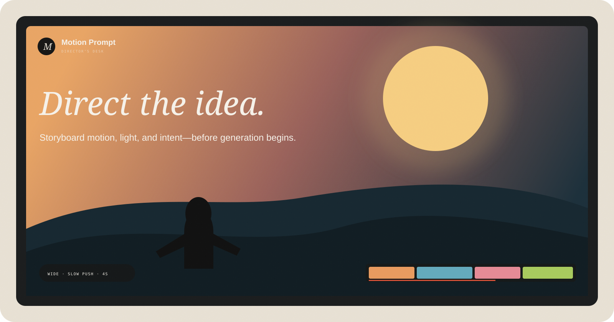
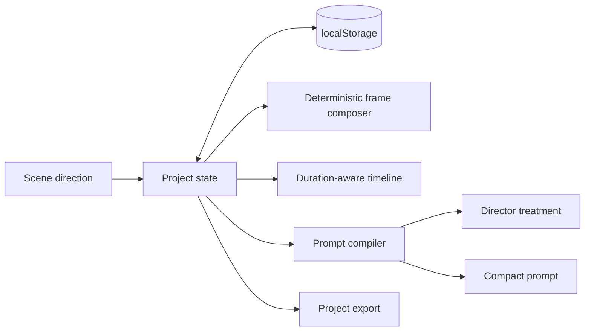

<div align="center">
  

  <br />

**A cinematic storyboard and prompt design studio for AI video direction.**

[](#quick-start)
[](#privacy)
[](app.js)
[](LICENSE)
</div>

## Direct before you generate

Text-to-video prompting often jumps from a loose paragraph straight to an expensive generation. Motion Prompt puts a **director’s desk** in the middle: scenes, pacing, camera, movement, light, palette, continuity, and constraints become visible decisions before a model receives anything.

The result is both a storyboard you can reason about and a model-agnostic production prompt you can take elsewhere.

> The frame preview is a deterministic abstract composition rendered with HTML and CSS. Motion Prompt does not generate video, call a model, or claim that the preview predicts a provider’s output.

## Highlights

- Build a multi-scene film with add, duplicate, delete, and reorder controls.
- Direct every beat by shot size, camera movement, lighting, palette, duration, and visual seed.
- **Remix local frames** deterministically without a network request.
- Play the full storyboard with duration-aware timeline progress.
- Switch between landscape, portrait, and square preview ratios.
- Compile a detailed treatment or compact provider-ready prompt.
- Export the full project as JSON or download the prompt as text.
- Keep the current production in `localStorage` between visits.

## Architecture



```text
index.html          director’s desk and prompt dialog
styles.css          editorial UI, frame art, timeline, motion
focus.css           distraction-free preview overlay
app.js              scene model, playback, compiler, persistence
assets/cover.svg     cinematic repository artwork
```

## Quick start

```bash
git clone https://github.com/harshareddy0405/motion-prompt.git
cd motion-prompt
python3 -m http.server 8080
```

Open [http://localhost:8080](http://localhost:8080). There is no install, account, API key, or build step.

## A two-minute product tour

1. Choose a scene and change its creative direction, shot, movement, and light.
2. Pick a palette, adjust its duration, then use **Remix frame** to change the local composition.
3. Add or duplicate a beat and use **Earlier / Later** to reshape the sequence.
4. Select **Play all** to read the film as a timed storyboard.
5. Open **Compile prompt** and compare treatment and compact formats.
6. Export the project JSON so the direction stays portable.

Keyboard controls work outside text fields:

| Key                         | Action                 |
| --------------------------- | ---------------------- |
| <kbd>←</kbd> / <kbd>↑</kbd> | Previous scene         |
| <kbd>→</kbd> / <kbd>↓</kbd> | Next scene             |
| <kbd>Space</kbd>            | Play / stop storyboard |
| <kbd>D</kbd>                | Duplicate scene        |
| <kbd>Delete</kbd>           | Delete scene           |

## Design decisions

- **Director language, not model jargon.** The controls describe creative intent people already understand.
- **Continuity is explicit.** Ordered scenes, runtime, palette, and seeds make cross-shot constraints visible.
- **Abstract preview, honest expectation.** Local artwork gives the storyboard rhythm without impersonating model output.
- **Model-agnostic compilation.** Prompts avoid proprietary parameters so the direction stays portable.

## Privacy

Project data stays in browser `localStorage`. There is no telemetry and no scene content is sent anywhere. Clear the site’s storage to remove the local draft.

Two presentation fonts are loaded from Google Fonts. Replace or self-host them for a fully offline deployment.

## Roadmap

- [ ] Drag-to-reorder timeline clips
- [ ] Transition design between adjacent scenes
- [ ] Negative prompt and continuity constraint library
- [ ] Reference-frame attachments with local-only thumbnails
- [ ] Provider adapters behind explicit opt-in permissions
- [ ] Storyboard PDF and edit-decision-list exports

## Contributing

Keep the prototype local-first and label every simulated behavior. Before opening a pull request, test narrow layouts, keyboard navigation, prompt exports, and reduced-motion mode.

## License

[MIT](LICENSE) © 2026 Harshavardhan

---

<div align="center"><sub>Built for the moment between an idea and the render queue.</sub></div>

## Built to be inspected

[](https://github.com/harshareddy0405/motion-prompt/actions/workflows/ci.yml)

The project includes versioned source, guarded local persistence, malformed-data recovery, product-specific interaction tests, and automated accessibility semantics checks. No API key is required to explore it.

```bash
# Optional development checks; the app itself needs no installation
npm ci --ignore-scripts
npm run check
npm test
npm run format:check
```

[Engineering notes](docs/ENGINEERING.md) · [Contributing](CONTRIBUTING.md) · [Security & privacy](SECURITY.md)

**Scope:** The abstract preview is HTML/CSS, not generated video. Output is a direction document; no provider API is called.
